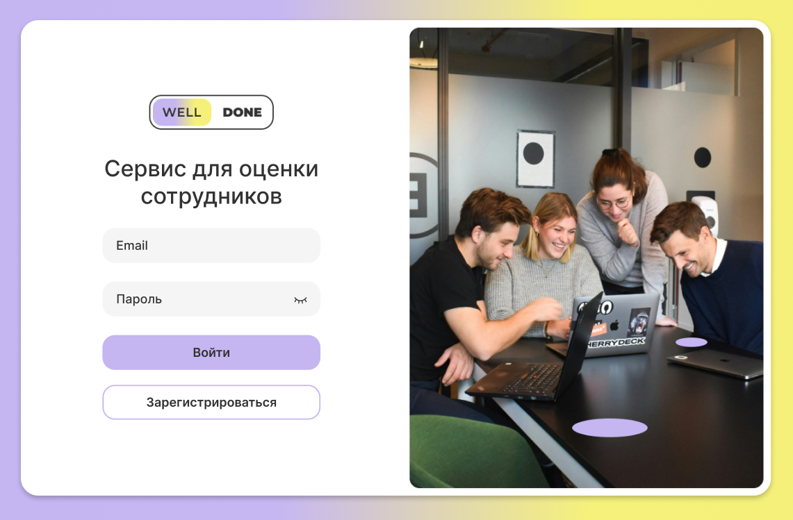
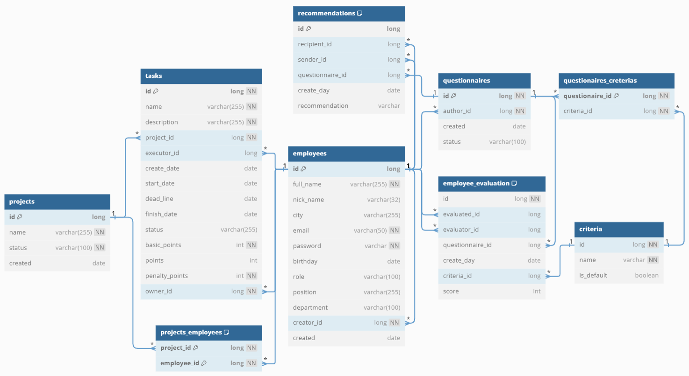

[](http://a0944694.xsph.ru/login)

# Well Done - сервис оценки эффективности сотрудников
[](https://www.oracle.com/java/)
[](https://spring.io/projects/spring-boot)
[-6AAD3D?style=for-the-badge&logo=spring-security&logoColor=90fd87)](https://spring.io/projects/spring-security)
[](https://www.postgresql.org/)
[](https://hibernate.org/)
[](https://maven.apache.org/)
[](https://www.docker.com/)
[](https://www.portainer.io/)
[](https://www.postman.com/)
[](https://editor-next.swagger.io/)
[](https://containrrr.dev/watchtower/)
[](https://github.com/features/actions)
[](https://www.liquibase.com/)
[](https://www.linux.org/)
[](https://junit.org/junit5/docs/current/user-guide/)
[](https://site.mockito.org/)
[](https://git-scm.com/)
[](https://mapstruct.org/)
[](https://github.com/zalando/logbook)

## Описание
На платформе руководитель распределяет задачи среди сотрудников и проводит анкетирование.
Из выполненных задач и оценок коллег складывается эффективность сотрудника. Согласно им руководитель принимает решения
относительно сотрудника - выдать бо'льшую премию, повысить в должности или наоборот.
Баллы за задачи нужны для оценки качеств сотрудника вне команды по итогам месяца, а оценки коллег позволяют определить,
насколько сотрудник является командным игроком и совпадает ли мнение руководителя с оценкой коллектива.

## Архитектура
Приложение запущено в виде 4 контейнеров:
- epa-backend - бекенд-приложение
- epa-frontend - фронтенд-приложение
- epa-db - база данных для хранения данных руководителей и их сотрудников
- watchtower - автоматическое обновление контейнеров при появлении новых docker-образов

## Функциональность
В приложении есть есть открытые эндпоинты для саморегистрации руководителей.
Закрытые эндпоинты различаются для руководителей и сотрудников.
Подробное описание эндпоинтов, классов и требований к ним приведены в спецификации
[Swagger](http://45.80.69.141:60606/swagger-ui/index.html#/)

## Диаграмма базы данных


## Как запустить и использовать
Приложение развёрнуто на хостинге по ссылке http://a0944694.xsph.ru/login

Для локального запуска бекенд-приложения с БД установите и откройте программу
[Docker Desktop](https://www.docker.com/products/docker-desktop/).
<br>Затем в командной строке cmd выполните следующие команды

   ```
git clone git@github.com:employee-performance-assessment/epa_backend.git
cd ~/epa-backend   
mvn clean package
git checkout dev
docker-compose up
   ```
Приложение готово к использованию! Сервис доступен по андресу [http://localhost:60606](http://localhost:60606).
<br>Swagger-документация при локальном запуске [http://localhost:60606/swagger-ui/index.html#/](http://localhost:60606/swagger-ui/index.html#/)
<br>Со сценариями работы приложения можно ознакомся, запустив коллекции
[Postman-тестов](postman/epa.postman_collection.json), указав в разделе Variables переменную baseUrl http://localhost:60606